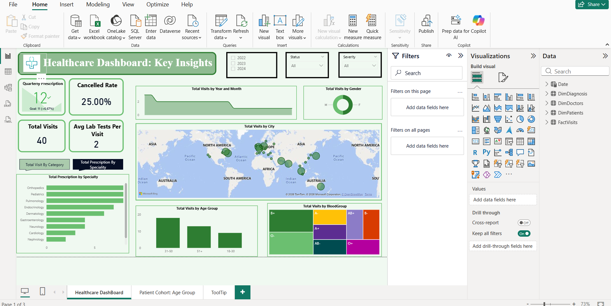
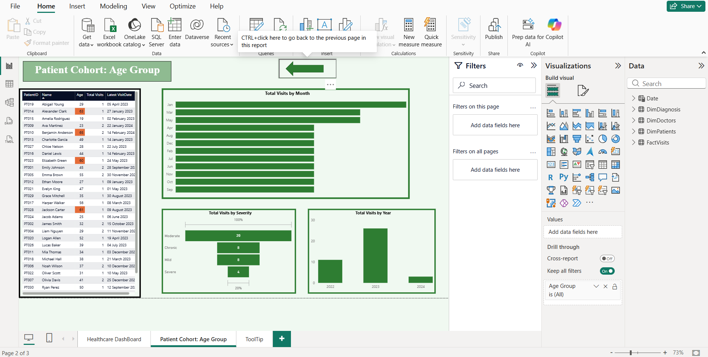
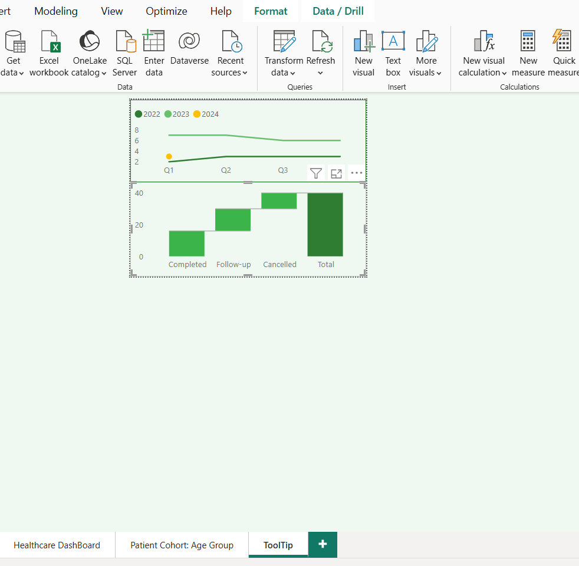

# Healthcare Analytics Dashboard (Power BI)

## Overview
This project presents an interactive Power BI dashboard designed to analyze patient visits, healthcare operations, and demographic patterns. It helps in understanding treatment trends, patient distribution, and key healthcare metrics.

## Objectives
- Analyze patient visits across time and categories  
- Track operational metrics such as cancellations and follow-ups  
- Understand patient demographics (age, gender, blood group)  
- Evaluate diagnosis severity and medical categories  
- Enable interactive exploration using filters and drill-through  

## Data Model
The data model follows a star schema design:

- Fact Table: FactVisits  
- Dimension Tables: DimPatients, DimDoctors, DimDiagnosis, Date  

This structure ensures efficient querying and better performance.

## Key Features
- KPI cards for Total Visits, Cancelled Rate, and Avg Lab Tests per Visit  
- Time-based analysis using a custom Date table  
- Demographic analysis (Age Group, Gender, Blood Group)  
- Category and severity-based healthcare insights  
- Map visualization for geographical distribution  
- Interactive slicers (Year, Status, Severity)  
- Bookmark-based toggle to switch between category and specialty views  
- Drill-through navigation and custom tooltip pages  

## Key DAX Measures

### Average Lab Tests per Visit
```DAX
Avg LabTests per Visit =
DIVIDE(
    SUM(FactVisits[LabTests]),
    COUNTROWS(FactVisits),
    BLANK()
)
```

### Age Group Segmentation
```DAX
Age Group =
SWITCH(
    TRUE(),
    DimPatients[Age] <= 30, "18-30",
    DimPatients[Age] <= 50, "31-50",
    "51+"
)
```

### Date Table Creation
```DAX
Date =
VAR MinDate = CALCULATE(MIN(FactVisits[VisitDate]))
VAR MaxDate = CALCULATE(MAX(FactVisits[VisitDate]))
RETURN
    CALENDAR(MinDate, MaxDate)
```

## Key Insights
- Patient visits vary across months with noticeable peaks in specific periods
- Certain medical categories contribute more to overall visits
- Moderate and chronic cases form a significant portion of diagnoses
- Majority of patients fall within specific age groups (31-50)
- Healthcare activity is concentrated in major urban locations

## Tools and Technologies
- Power BI
- DAX (Data Analysis Expressions)
- Data Modeling (Star Schema)
- Data Visualization

## Dashboard Preview

### Healthcare Overview Dashboard



### Patient Cohort Analysis



### Tooltip Analysis View



## Learnings
- Implemented star schema data modeling for real-world scenarios
- Applied DAX for KPI calculations and feature engineering
- Built interactive dashboards using bookmarks and tooltips
- Improved understanding of healthcare data analysis
- Enhanced skills in designing user-friendly dashboards
